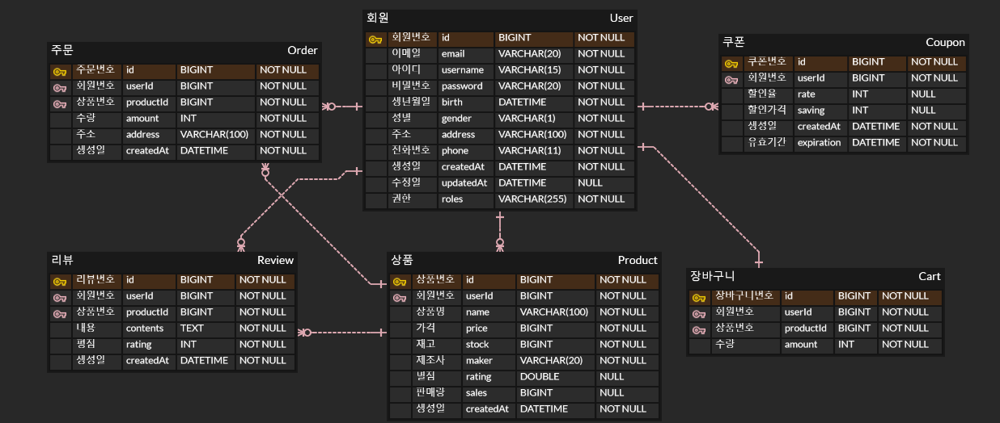

# 📦🚚 E-Commerce Project

## 소개
간단한 이커머스 서비스 프로젝트

## 프로젝트 기능 및 설계
### 회원가입과 로그인
- 회원가입
    - 회원가입시 이메일, 이름, 비밀번호, 생년월일, 성별, 주소, 전화번호 정보가 필요하다.
    - 이메일 인증이 완료되면 정상적으로 회원가입을 완료하고, 그렇지 않으면 보류한다.
    - 회원가입시 이미 회원가입된 이메일과 이름으로 회원가입을 시도하면 에러를 발생한다.

- 로그인
    - 로그인시 회원가입한적 없는 이메일을 이용하여 로그인을 시도하면 에러가 발생한다.
    - 로그인시 비밀번호가 일치하지 않는다면 에러가 발생한다.
    - 회원가입시에 부여된 권한에 따라 JWT을 생성하여 응답한다.

- 관리자 로그인
    - 관리자 로그인 시 상품을 등록, 삭제, 회원, 주문 관리를 할 수 있다.

### 주문 및 조회 기능
- 상품명 검색
    - 상품 검색은 로그인 여부와 관계없이 진행할 수 있다.
    - 검색창에 입력한 단어로 시작되는 상품명을 가진 상품들을 자동완성한다.

- 상품 상세 조회
    - 상품 상세 조회 시 상품명, 가격, 리뷰, 현재 재고, 제조사등 상품에 대한 정보를 확인할 수 있다.

- 상품 주문
    - 구매할 상품의 수량, 배송받을 주소를 입력해야 주문이 가능하다.

### 상품 장바구니 기능

- 상품 담기
    - 로그인 된 회원은 상품을 본인의 장바구니에 담을 수 있다.

- 장바구니 목록
    - 로그인 된 회원은 본인의 장바구니를 조회할 수 있다.

- 장바구니 삭제
    - 로그인 된 회원은 본인의 장바구니 목록을 삭제 할 수 있다.

- 쿠폰
    - 회원의 모든 쿠폰을 조회할 수 있다.
    - 쿠폰은 한개의 상품에 적용 가능하며, 상품 가격은 0원 이하로 내려가지 않는다.

## ERD

## Trouble Shooting
[go to the trouble shooting section](doc/TROUBLE_SHOOTING.md)

### Tech Stack

 
   
   
   
  
  

